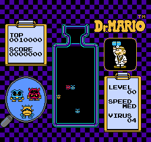

# Dr. Mario Yellow Virus Tile 2nd Frame Fix

There is a mistake in the graphics involving the Yellow Virus tiles that for some reason in the 2nd bank kept the early "red-tongue" design from the 3rd prototype of "Virus" which Nintendo forgot to change. However in the first bank where the viruses below the first frame still have the 2nd frame the correct final Yellow Virus's 2nd frame is there but not accessed due to instead using bank switching to animate them easily. This patch corrects it to what it intend to be.

As this patch only affects the CHR, it is compatible with any of the 3 game versions and can be combined with the [Input Fixes](https://romhacking.net/hacks/8200) patch of the matching game version.

